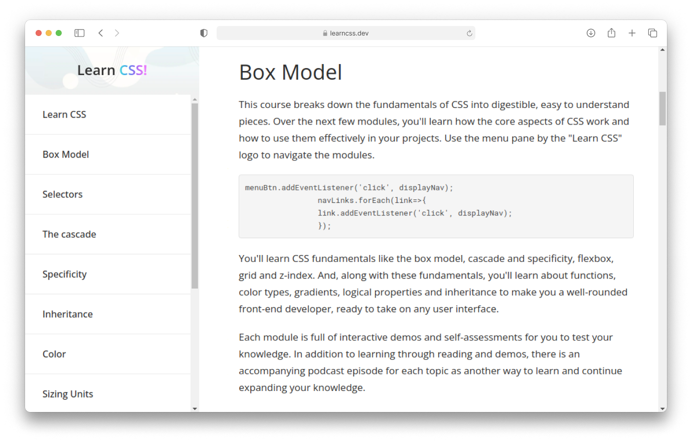

# 📖 CSS Documentation Page
**Project within:** Responsive Web Design Certification by Free Code Camp <a href="https://www.freecodecamp.org/learn/responsive-web-design/responsive-web-design-projects/build-a-product-landing-page/">View Certification</a>

**Objective:** Build a Technical Documentation Page

**Requirements:** <a href="https://www.freecodecamp.org/learn/responsive-web-design/responsive-web-design-projects/build-a-technical-documentation-page/">View Requirements</a>

**Solution Link:** <a href="https://cosminmoldovan.github.io/fcc-technical-documentation-page/">Live Demo</a>

